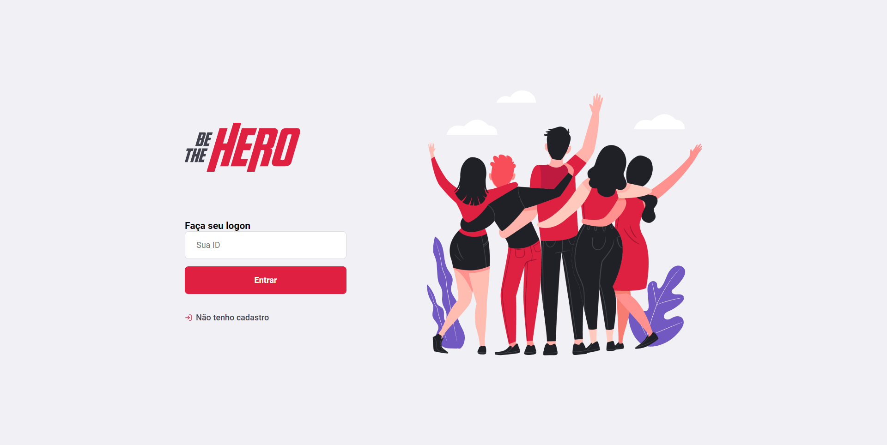
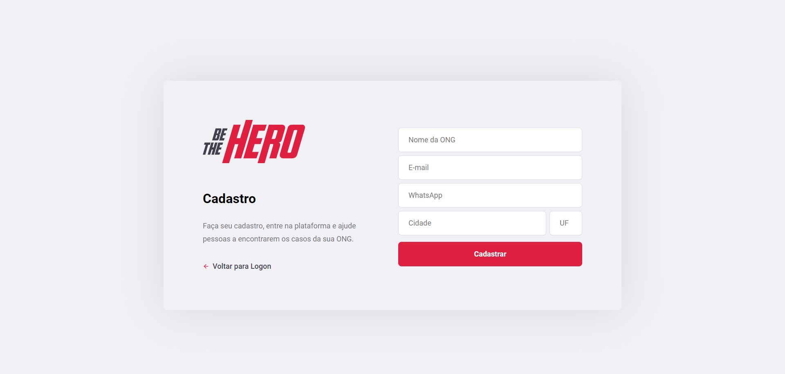
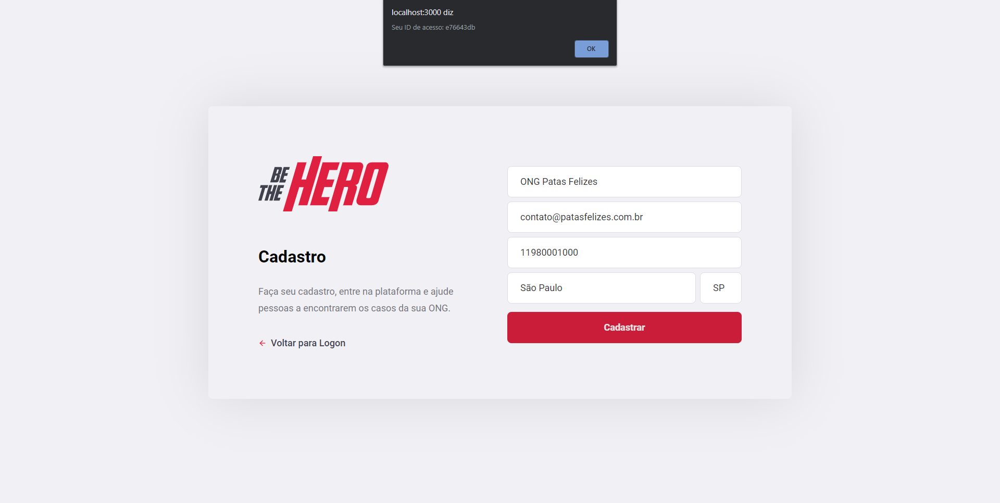
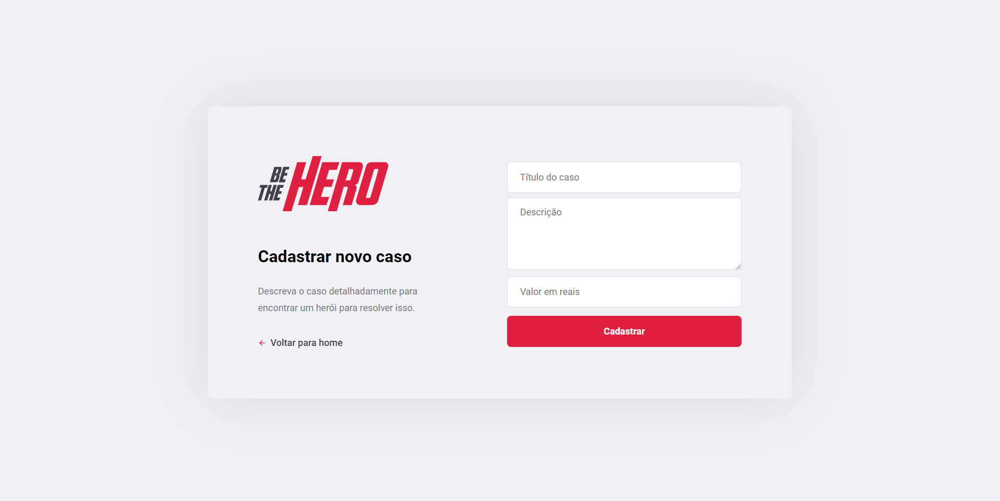
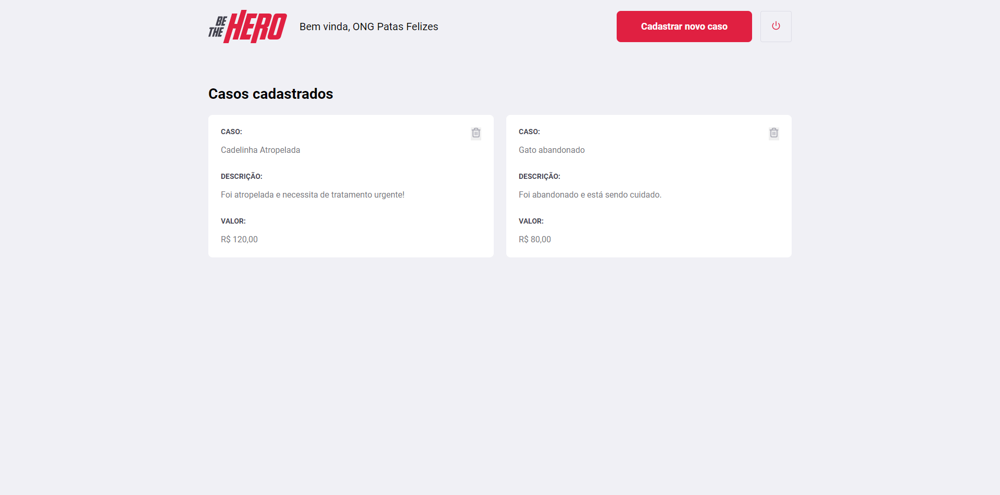
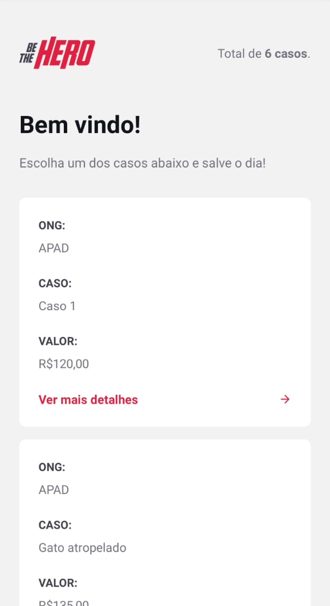
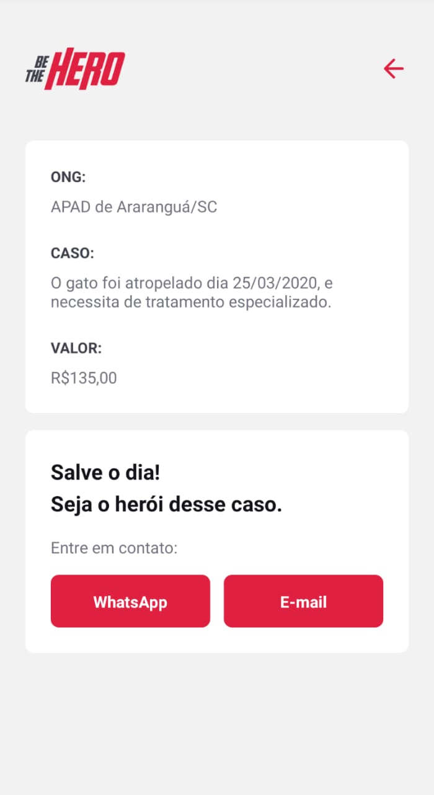
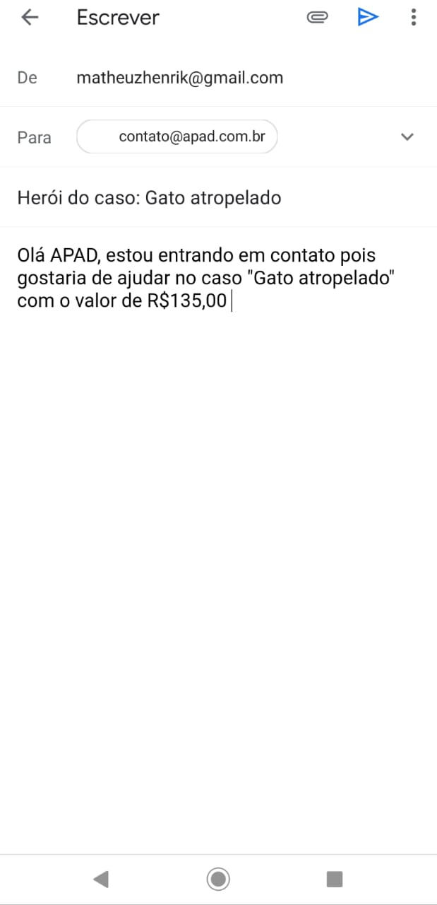
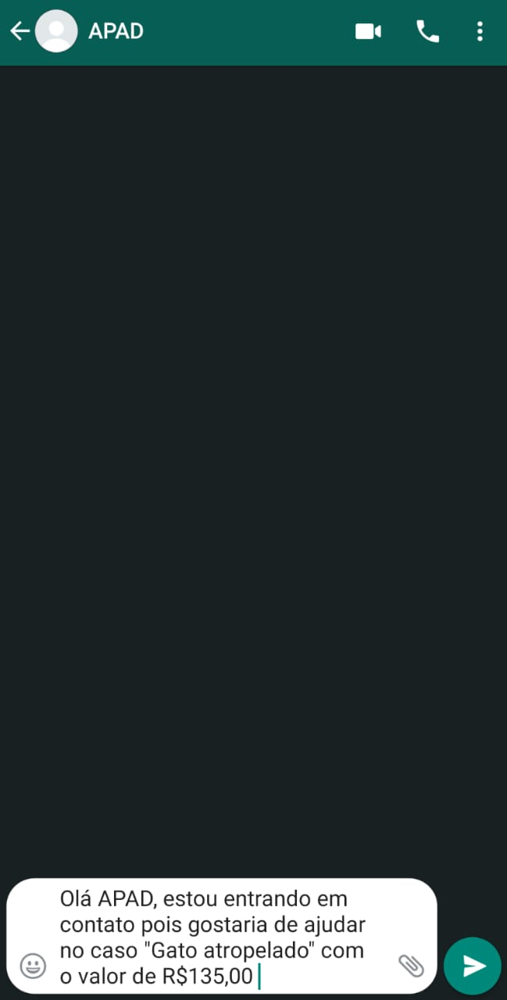

<h1 align="center"> Semana OmniStack 11 </h1>

<h1 align="center"> Be The Hero <h1>

 O Objetivo principal desta API é que ONGS possam criar seus casos pelo sistema WEB, já no aplicativo mobile voluntários podem ver os casos e entrar em contato com as ONGS para ajudarem nos casos 

<h1 align="center"> Front End </h1>

 Desenvolvido em React 

<h2> Logon </h2>

<h2> Cadastro </h2>

<h2> Cadastro realizado </h2>

 Ao realizar o cadastro, retorna-se o ID que será usado para realizar Logon 

<h2> Cadastro de casos </h2>

<h2> Listagem de casos </h2>

<h1 align="center"> Back End </h1>

 Desenvolvido em NodeJS 

<h1 align="center"> Mobile </h1>

 Desenvolvido em React Native 

<h2> Home </h2>

    

<h2> Caso detalhado </h2>

    

<h2> Contato via E-mail </h2>

 Ao clicar no botão E-mail, o usuário é redirecionado para enviar um e-mail para a ONG responsável pelo caso. 

    

<h2> Contato via WhatsApp </h2>

 Ao clicar no botão WhatsApp, o usuário é redirecionado para o WhatsApp para mandar uma mensagem a ONG responsável pelo caso. 

    

<h1 align="center"> Licenças </h1>

    <a href="https://github.com/matheuskolln/omnistack11/blob/master/LICENSE"> MIT </a> <a href="https://rocketseat.com.br/"> Rocketseat </a>

